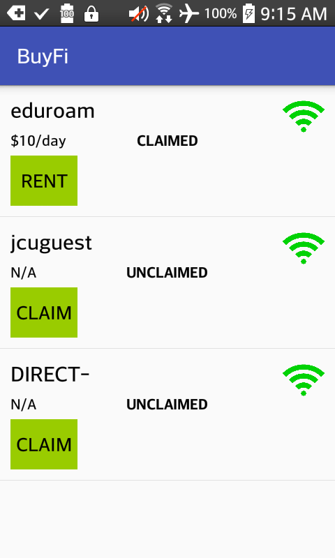

# BuyFi

Introducing **BuyFi**. 
**BuyFi** is an android application designed to connect users who wish to buy and sell access to privately owned wireless networks. Currently, **BuyFi** is in Alpha version 1.0.

## Alpha Version 1.0 Release

The current version of **BuyFi** is a simple interface which allows a user to discover networks to purchase access, or to claim as the owner and enter contact information to allow buyers to arrange a sale.

The application uses the device's wireless band to scan for networks in range and list them with their respective purchase details (Ownership, Price, Contact Information). You can not buy from, or claim as host any network out of range of your device.

## Installation

 - Onto an Android Device (API 15+)  
		 - Download and install "BuyFi.apk" (Must allow installation from unknown sources on device)
- View and install from Android Studio

		> git clone https://github.com/LuKenneth/BuyFi.git

## User Guide
 - Make sure location services is enabled on your device.
 - Upon opening the application, a list of network within range will appear (if any).
 -  Tap on the button that reads "RENT" or "CLAIM" to view details of the network which will include, if the network is owned, the price and contact information of the owner. If it is not claimed, you may then submit a claim as the owner of the network and list your price and contact information.

## Known Issues / Missing Functionality (TO-DO List)

**Owning Network**
 - Currently, when claiming to be the owner of a network, the application only checks to make sure you are already connected to the network. If you are connected to the network, you are assumed to have the network password that you can then sell to other users.
- You can not edit details of an owned network after claiming as the owner.
- To claim a network you must be connected to the network at the time of claim.
- After entering claimed network information, you cannot change it.

**Multiple Access Points**
 - Each access point has its own listing. If you claim to be the owner of one access point, your other access points will not have the same ownership status. You must claim to be the owner of each access point.
 - If a network has multiple access points, the application will only display the access point with the strongest current signal. 

**Payments**
 - BuyFi currently does not support any in-house payment processing systems. Point-of-sale must occur outside of the application.

**Accounts**
 - There is no current support for creating and maintaining user accounts.

 